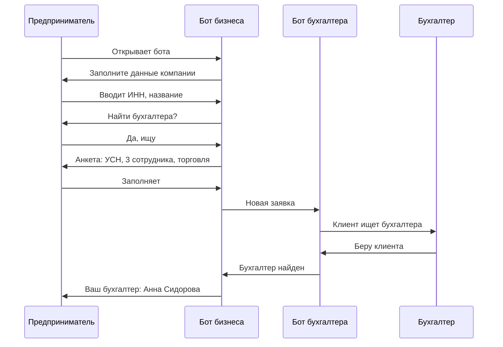
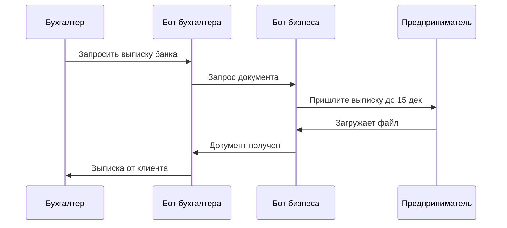

# Типовые сценарии

Как боты работают вместе в реальных ситуациях.

[[00-Навигация|← Назад к навигации]]

---

## Сценарий 1: Новый клиент ищет бухгалтера

### Участники
- Предприниматель (бот бизнеса)
- Бухгалтер (бот бухгалтера)

### Путь

### Шаги

1. **Предприниматель** открывает [[02-Бот-бизнеса#1 Старт пользователь открывает чат|бота бизнеса]]
2. Вводит данные компании → [[02-Бот-бизнеса#2 Загрузка базы|Загрузка базы]]
3. Выбирает «Найти бухгалтера» → [[02-Бот-бизнеса#4 Поиск бухгалтера|Поиск]]
4. Заполняет анкету
5. **Бот бухгалтера** уведомляет бухгалтеров → [[01-Бот-бухгалтера#10a Заявка клиента|Заявка]]
6. **Бухгалтер** берёт клиента → [[01-Бот-бухгалтера#10b Взять клиента|Подтверждение]]
7. **Предприниматель** получает контакты бухгалтера

---

## Сценарий 2: Бухгалтер запрашивает документы

### Участники
- Бухгалтер (бот бухгалтера)
- Предприниматель (бот бизнеса)

### Путь

### Шаги

1. **Бухгалтер** открывает карточку клиента → [[01-Бот-бухгалтера#4 Карточка клиента|Карточка]]
2. Выбирает «Запросить документы» → [[01-Бот-бухгалтера#6 Запрос документов|Запрос]]
3. Указывает тип и период
4. **Бот бизнеса** уведомляет клиента → [[02-Бот-бизнеса#5 Входящие запросы|Запросы]]
5. **Предприниматель** загружает файл → [[02-Бот-бизнеса#5c Файл загружен|Загрузка]]
6. **Бухгалтер** получает документ

---

## Сценарий 3: Клиент не отвечает

### Участники
- Бухгалтер (бот бухгалтера)
- Предприниматель (бот бизнеса)

### Путь

1. Бухгалтер отправляет запрос
2. Клиент не отвечает 3 дня
3. Бот автоматически напоминает клиенту
4. Клиент не отвечает ещё 2 дня
5. Бот уведомляет бухгалтера о проблеме
6. Бухгалтер решает: напомнить ещё раз или связаться напрямую

### Шаги

1. **Бот бизнеса** отправляет напоминание → [[02-Бот-бизнеса#9 Напоминания|Напоминание]]
2. Если клиент не реагирует → [[02-Бот-бизнеса#10 Пользователь не готов работать|Статус «не готов»]]
3. **Бот бухгалтера** показывает статус → [[01-Бот-бухгалтера#7 Проверка статуса|Статус]]
4. Бухгалтер отправляет ручное напоминание → [[01-Бот-бухгалтера#7a Напоминание|Напоминание]]

---

## Сценарий 4: Бухгалтер отправляет отчёт

### Участники
- Бухгалтер (бот бухгалтера)
- Предприниматель (бот бизнеса)

### Шаги

1. **Бухгалтер** открывает карточку клиента → [[01-Бот-бухгалтера#4 Карточка клиента|Карточка]]
2. Выбирает «Отправить отчёт» → [[01-Бот-бухгалтера#8 Отправка отчёта|Отправка]]
3. Выбирает тип отчёта, добавляет комментарий
4. **Предприниматель** получает уведомление → [[02-Бот-бизнеса#8 Уведомления от бухгалтера|Уведомление]]
5. Скачивает файл или задаёт вопрос

---

## Сценарий 5: Сбор обратной связи

### Когда запускается
- В конце месяца
- После завершения крупной задачи (сдача отчётности)

### Шаги

1. **Бот бизнеса** спрашивает клиента → [[02-Бот-бизнеса#11 Запрос обратной связи|Обратная связь]]
2. Клиент отвечает
3. **Бот бухгалтера** показывает отзыв бухгалтеру
4. **Бот бухгалтера** спрашивает бухгалтера → [[01-Бот-бухгалтера#11 Сохранение и запрос обратной связи|Обратная связь]]
5. Данные сохраняются в статистику

---

## Связанные разделы

- [[01-Бот-бухгалтера|Бот бухгалтера]]
- [[02-Бот-бизнеса|Бот бизнеса]]
- [[03-Сообщения-бота|Все сообщения]]
- [[00-Навигация|Навигация]]
