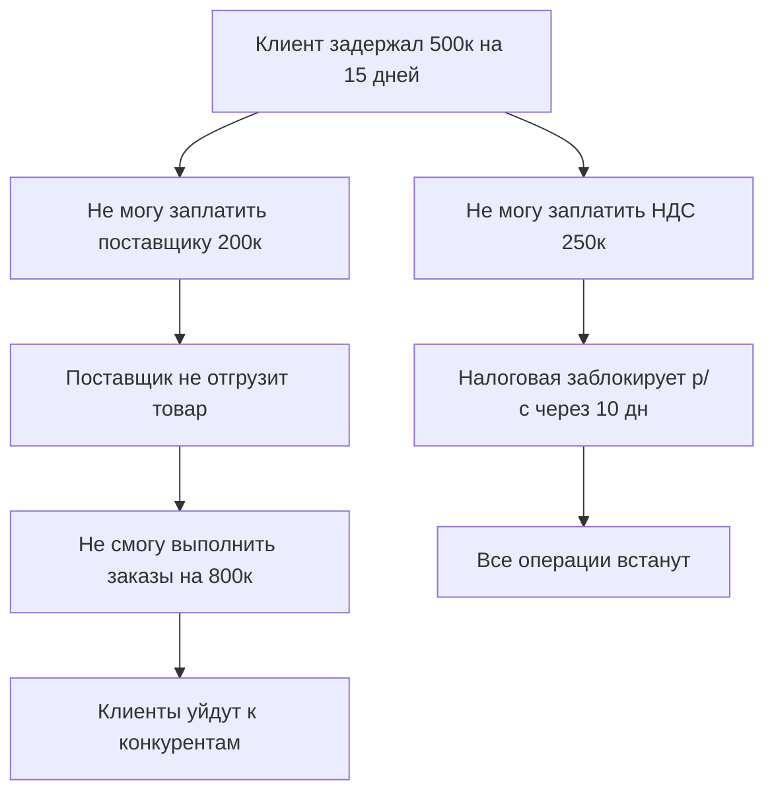

# ТЕХНИЧЕСКОЕ ЗАДАНИЕ: ТОП-10 БИЗНЕС-ИНСТРУМЕНТОВ
## Постановка задачи от CFO/Главного бухгалтера

---

## 1. ТРЕКЕР ЛИКВИДНОСТИ В РЕАЛЬНОМ ВРЕМЕНИ (#128)
**Оценка: 7,290 | Приоритет: КРИТИЧЕСКИЙ**

### 1.1 Бизнес-задача
Видеть кэш-позицию на сегодня/завтра/неделю для принятия быстрых решений в условиях ежедневных изменений.

### 1.2 Требуемые данные

#### Первичные источники:
**А. Банковские остатки (актуализация 4 раза/день)**
- Расчетные счета в банках (все р/с)
- Корпоративные карты
- Депозиты до востребования
- **Источник:** Банк-клиент (Сбер-Бизнес, Альфа-Бизнес, Тинькофф и т.д.)
- **Формат выгрузки:** 1C:Банк (файл .txt), API банка, или ручной экспорт XLS
- **Почему просто:** Любой банк-клиент дает выписку за 5 секунд

**Б. Кассовые остатки**
- Касса в офисе (если применимо)
- **Источник:** 1С:Бухгалтерия, счет 50 "Касса"
- **Почему просто:** Обязательная проводка при любых операциях

**В. График платежей на 7 дней**
| Дата | Контрагент | Сумма | Назначение | Критичность |
|------|------------|-------|------------|-------------|
| 17.10 | ИП Иванов | 150 000 | Зарплата | Обязательно |
| 18.10 | ИФНС | 230 000 | НДС | Обязательно |
| 19.10 | ООО Поставщик | 85 000 | Товар | Можно отложить |

**Источник:** 
- Реестр платежей (Excel/Google Sheets/1C:ЗУП)
- Календарь налоговых платежей (НДС до 28-го числа, НДФЛ до 28-го, взносы до 28-го)
- Договоры с поставщиками (график оплат)

**Г. Ожидаемые поступления**
- Счета к оплате клиентам (с разбивкой по датам обещанной оплаты)
- Дебиторская задолженность с просрочкой (отдельно выделить "живую" и "мертвую")
- **Источник:** CRM (AmoCRM, Битрикс24), 1С:УТ, Excel-реестр счетов

### 1.3 Методология расчета

```
ФОРМУЛА ЛИКВИДНОСТИ:

Кэш на дату D = 
  Остаток_банк(D-1) 
  + Остаток_касса(D-1)
  + СУММ(Поступления[D])
  - СУММ(Обязательные_платежи[D])
  - СУММ(Опциональные_платежи[D] * вес_приоритета)

Критический порог = MIN(
  30% от ежемесячного ФОТ,
  Сумма налогов на неделю,
  Операционный минимум по отрасли
)

СВЕТОФОР:
🟢 Зелёный: Кэш > 2 × Критический_порог
🟡 Жёлтый: Кэш от 1 до 2 × Критический_порог  
🔴 Красный: Кэш < Критический_порог
```

### 1.4 Источники данных в России

1. **1С:Бухгалтерия 8.3**
   - Отчет: "Оборотно-сальдовая ведомость по счету 51 (Расчетные счета)"
   - Периодичность: в режиме реального времени
   - Экспорт: Excel, TXT, DBF

2. **Интеграция с банками:**
   - Сбербанк API (https://api.sberbank.ru/prod/tokens)
   - Тинькофф API (https://business.tinkoff.ru/openapi/)
   - Альфа-Банк "Альфа-Директ" (файловый обмен)

3. **Календарь налоговых платежей 2025:**
   - НДС: до 28-го числа месяца, следующего за отчетным кварталом
   - Налог на прибыль: ежемесячные авансы до 28-го числа
   - НДФЛ: до 28-го числа месяца, следующего за месяцем выплаты
   - Страховые взносы: до 28-го числа месяца, следующего за расчетным

### 1.5 Методология кросс-чека

**Проверка 1: Банковская сверка**
```
Остаток_в_трекере(16.10.2025) = Остаток_в_банке(16.10.2025)
Допустимое расхождение: 0 рублей
```

**Проверка 2: Баланс с бухгалтерией**
```
СУММ(51.01 + 51.02 + ... + 50) в_1С = Остаток_в_трекере
Сверка: ежедневно в 23:59
```

**Проверка 3: Прогноз vs факт**
```
За прошедшую неделю:
Точность_прогноза = |Прогноз_поступлений - Факт_поступлений| / Факт
Норма: < 15%
Если >25% → пересмотреть методику оценки поступлений
```

**Проверка 4: Контроль забытых платежей**
- Запрос в бухгалтерию: "Какие договоры истекают в следующие 7 дней?"
- Сверка с реестром договоров (1С:Документооборот)

---

## 2. КАЛЬКУЛЯТОР ПОРОГА РЕНТАБЕЛЬНОСТИ (#134)
**Оценка: 6,480 | Приоритет: КРИТИЧЕСКИЙ**

### 2.1 Бизнес-задача
При падении маржи с 30% до 10% узнать новую точку безубыточности в штуках/рублях для пересмотра планов продаж.

### 2.2 Требуемые данные

**А. Постоянные расходы (Fixed Costs)**
Данные за последний полный месяц из 1С:

| Статья | Счет 1С | Сумма/мес | Источник |
|--------|---------|-----------|----------|
| Аренда офиса | 26.01 | 180 000 | Договор аренды |
| ФОТ (оклады) | 26.02 + 70 | 850 000 | 1С:ЗУП |
| Страховые взносы (оклады) | 69 | 255 000 | 30% от ФОТ (с 2025: IT 15%, остальные 30%) |
| Коммунальные | 26.04 | 45 000 | Счета |
| Связь, интернет | 26.05 | 12 000 | Счета |
| Бухгалтерия/юристы | 26.06 | 35 000 | Договоры |
| Банковское обслуживание | 91.02 | 8 000 | Тарифы банка |
| Амортизация | 02 | 25 000 | ОСВ по сч. 02 |
| **ИТОГО FC** | — | **1 410 000** | — |

**Источник в 1С:**
- Отчет: "Анализ счета 26 (Общехозяйственные расходы)" за месяц
- Отчет: "Анализ счета 44 (Расходы на продажу)" - постоянная часть
- Отчет: "Расчет зарплаты" (1С:ЗУП) - оклады отдельно от премий

**Б. Переменные расходы на единицу (Variable Costs per Unit)**

Для **товарной компании:**
```
VC_unit = Себестоимость товара + Комиссия маркетплейса (%) + Логистика
```

Пример:
- Товар закупается за 500 руб.
- Комиссия Ozon: 10% = 50 руб. (от цены продажи 1000 руб.)
- Доставка: 80 руб.
- **VC = 630 руб.**

Для **услуговой компании:**
```
VC_unit = Зарплата_специалиста_на_проект + Матзатраты
```

Пример (IT-разработка):
- Час разработчика: 1500 руб. (сдельная часть)
- Проект = 40 часов = 60 000 руб.
- Матзатраты (сервера, софт): 5 000 руб.
- **VC = 65 000 руб.**

**Источник:**
- 1С: Отчет "Себестоимость товаров" (счет 41 → 90.02)
- Или управленческий учет: "Калькуляция по проектам"

**В. Цена продажи (Price)**
- Средний чек = СУММ(Выручка_за_месяц) / СЧЁТ(Транзакций)
- **Источник:** CRM-система, 1С:УТ, отчет "Продажи по номенклатуре"

**Г. Маржинальность ДО и ПОСЛЕ**

| Параметр | До НДС (УСН 6%) | После НДС (ОСН) | Изменение |
|----------|-----------------|-----------------|-----------|
| Цена | 1000 | 1000 + 20% = 1200? | Нет, цена для клиента не меняется! |
| Цена фактическая | 1000 | 1000 / 1.2 = 833 (без НДС) | -167 |
| VC | 630 | 630 | 0 |
| **Маржа на единицу** | 370 (37%) | 203 (24%) | **-45% маржи** |

**Ключевая ошибка:** Многие думают, что "просто +20% к цене", но клиент платит ту же 1000 руб., из которых 167 руб. = НДС государству.

### 2.3 Методология расчета

**Формула точки безубыточности (BEP):**

```
BEP_units = FC / (Price - VC)

BEP_руб = BEP_units × Price

Маржинальность = (Price - VC) / Price × 100%
```

**Пример расчета:**

**До НДС (УСН):**
- FC = 1 410 000 руб./мес
- Price = 1000 руб.
- VC = 630 руб.
- Маржа = 370 руб.
- **BEP = 1 410 000 / 370 = 3,811 штук/месяц**
- **BEP_руб = 3,811 × 1000 = 3 811 000 руб./мес**

**После НДС (ОСН):**
- FC = 1 410 000 руб./мес (без изменений)
- Price = 833 руб. (без НДС)
- VC = 630 руб.
- Маржа = 203 руб.
- **BEP = 1 410 000 / 203 = 6,946 штук/месяц** (+82%!)
- **BEP_руб = 6,946 × 1000 = 6 946 000 руб./мес**

**Вывод:** Нужно продавать на 82% больше, чтобы выйти в ноль.

### 2.4 Источники данных в России

1. **1С:Бухгалтерия:**
   - ОСВ по счету 26 за последний месяц → FC
   - Анализ счета 90 "Продажи" → выручка и себестоимость
   - Отчет "Валовая прибыль" → маржинальность

2. **1С:Управление торговлей:**
   - Отчет "ABC-анализ номенклатуры" → средний чек
   - Отчет "Валовая прибыль по номенклатуре" → VC

3. **Excel-модель (если нет 1С:УТ):**
   - Скачать выписку по 90 счету
   - Разделить вручную на FC и VC

### 2.5 Методология кросс-чека

**Проверка 1: Баланс доходов-расходов**
```
Выручка_факт = FC + VC_total + Прибыль

Если Прибыль = 0, то:
Выручка_на_BEP = FC + VC_total

Сверка: Выручка_расчетная = BEP_units × Price
```

**Проверка 2: Сверка с фактом прошлого месяца**
```
Фактическая_прибыль = (Факт_продаж - BEP_units) × Маржа

Сверка с бухгалтерским результатом:
Прибыль_1С (сч. 99) = Фактическая_прибыль ± 5%
```

**Проверка 3: Динамика маржинальности**
```
Проверить маржу за последние 3 месяца:
Янв: 37%
Фев: 35%
Март: 32% → тренд снижения!

Если разброс >10% → пересчитать VC (возможно, цены поставщиков скачут)
```

**Проверка 4: Сравнение с отраслевыми нормами**
- Торговля: маржа 20-30%, BEP 3-5 оборотов склада/мес
- IT-услуги: маржа 40-60%, BEP 50-70% от мощности команды
- Производство: маржа 15-25%, BEP 60-80% от мощности

---

## 3. МАТРИЦА ПРИОРИТЕТОВ ПЛАТЕЖЕЙ (#122)
**Оценка: 5,760 | Приоритет: КРИТИЧЕСКИЙ**

### 3.1 Бизнес-задача
При нехватке денег ранжировать платежи (НДС, зарплата, аренда, поставщики), чтобы не схлопнуться.

### 3.2 Требуемые данные

**А. Все обязательства на ближайшие 30 дней:**

| Платеж | Сумма | Дата | Последствия неуплаты | Приоритет |
|--------|-------|------|---------------------|-----------|
| НДС в бюджет | 250 000 | 28.10 | Штраф 20% + пени 0,03%/день | **P1** |
| НДФЛ (зарплата сентябрь) | 45 000 | 28.10 | Штраф 20%, блокировка р/с | **P1** |
| Зарплата октябрь | 650 000 | 05.11 | Иск в суд, потеря команды | **P1** |
| Страховые взносы | 195 000 | 28.10 | Штраф 20%, растет долг | **P2** |
| Аренда офиса | 180 000 | 05.11 | Расторжение в 3 мес, залог сгорит | **P2** |
| Кредит в банке | 120 000 | 15.11 | Штраф 0,1%/день, порча кредистории | **P2** |
| Контрагент (товар отгружен) | 340 000 | 20.11 | Пени 0,03%/день, суд через 90 дн | **P3** |
| Контрагент (предоплата) | 150 000 | 10.11 | Не отгрузят, можно договориться | **P4** |

**Источники данных:**

1. **Налоговый календарь (автоматический):**
   - НДС: 1/3 каждый месяц (если квартальный НДС 750к, то 250к/мес)
   - НДФЛ: выплатили зарплату 30.09 → платеж до 28.10
   - Взносы: с ФОТ сентября до 28.10
   - **Источник:** НК РФ ст. 174 (НДС), 226 (НДФЛ), 431 (взносы)

2. **Кредитный договор:**
   - График платежей из банка (Сбер, ВТБ, Альфа)
   - Аннуитет или дифференцированный
   - **Получить:** Личный кабинет банка, раздел "Кредиты"

3. **Договоры с контрагентами:**
   - Реестр договоров (Excel/1С:Документооборот)
   - Акты сверки (запросить у контрагентов)
   - **Источник:** Бухгалтерия, счета 60 (поставщики), 62 (покупатели)

4. **Реестр судебных и исполнительных дел:**
   - Проверка на сайте ФССП (fssp.gov.ru) - есть ли исполнительные листы
   - Картотека арбитражных дел (kad.arbitr.ru)

### 3.3 Методология приоритизации

**Классификация P1-P5:**

```
P1 - КРИТИЧНО (неуплата = остановка бизнеса в течение 7 дней):
  - Налоги с риском блокировки р/с (НДС, НДФЛ, акцизы)
  - Зарплата (риск забастовки ключевых сотрудников)
  - Коммунальные (отключат свет/газ)

P2 - ВЫСОКИЙ (неуплата = проблемы в течение 30 дней):
  - Страховые взносы (штраф, но р/с не блокируют)
  - Аренда (расторжение не мгновенное)
  - Кредиты (портится репутация)

P3 - СРЕДНИЙ (неуплата = можно договориться на 60-90 дней):
  - Поставщики за отгруженный товар
  - Услуги (реклама, консалтинг)

P4 - НИЗКИЙ (можно отложить на 90+ дней):
  - Предоплаты (ещё не получили товар)
  - Бонусы сотрудникам

P5 - ОПЦИОНАЛЬНЫЙ:
  - Дивиденды
  - Инвестиции в развитие
```

**Формула расчета штрафа за просрочку:**

```python
def calculate_penalty(amount, days_overdue, penalty_rate=0.0003):
    """
    amount: сумма долга
    days_overdue: дни просрочки
    penalty_rate: ставка пени (по умолчанию 0,03% = 1/300 ставки рефинансирования 9%)
    
    Ставка ЦБ 16% → пени = 16% / 300 = 0,053% в день
    """
    daily_rate = 0.16 / 300  # Актуальная ставка на окт 2025: 16%
    return amount * daily_rate * days_overdue
```

**Пример:**
- НДС 250 000 руб. просрочен на 10 дней
- Пени = 250 000 × (0,16/300) × 10 = **1,333 руб./день** × 10 = 13,333 руб.
- Штраф налоговой = 20% = 50 000 руб.
- **ИТОГО: 63,333 руб. за 10 дней!**

### 3.4 Источники данных в России

1. **Ставка рефинансирования ЦБ:**
   - Сайт: https://cbr.ru/hd_base/KeyRate/
   - Актуальная (окт 2025): 16%
   - Обновляется: каждое заседание Совета директоров (8 раз/год)

2. **Налоговый кодекс РФ:**
   - Ст. 75: расчет пени = 1/300 ставки рефинансирования
   - Ст. 122: штраф за неуплату налогов 20% (или 40% если умышленно)
   - Ст. 123: штраф за неперечисление НДФЛ 20%

3. **1С:Бухгалтерия:**
   - Отчет "Расчеты с бюджетом" (счета 68, 69)
   - Карточка счета 68.02 "НДС" → когда платить
   - Отчет "Задолженность перед персоналом" (счет 70)

4. **Банковские договоры:**
   - Раздел "Последствия просрочки"
   - Обычно: 0,1-0,5% в день (36-180% годовых!)

### 3.5 Методология кросс-чека

**Проверка 1: Полнота списка**
```
Сумма_всех_платежей = Сальдо_счета_51 + Ожидаемые_поступления - Остаток_нужный

Если Сумма_всех_платежей < Реальные_обязательства:
  → Проверить, не забыли ли:
    - Аванс по налогу на прибыль
    - Транспортный налог
    - Плату за негативное воздействие (если производство)
```

**Проверка 2: Актуальность данных**
```
Дата_последнего_обновления_налогов < 7 дней
Дата_последней_сверки_с_контрагентами < 30 дней
```

**Проверка 3: Юридическая корректность**
```
Для каждого P1-платежа проверить:
  - Есть ли нормативный акт, подтверждающий последствия?
  - Каков реальный срок до блокировки р/с? (ФНС: 8-10 дней после неуплаты)
```

**Проверка 4: Сравнение с фактом прошлого месяца**
```
Сколько раз откладывали платежи P3-P4?
Сколько раз это приводило к реальным проблемам?

Корректировать приоритеты на основе опыта.
```

---

## 4. СИМУЛЯТОР КАСКАДНОГО КРАХА (#120)
**Оценка: 5,040 | Приоритет: КРИТИЧЕСКИЙ**

### 4.1 Бизнес-задача
При задержке оплаты крупным клиентом увидеть цепную реакцию (кому я не смогу заплатить), чтобы договориться заранее.

### 4.2 Требуемые данные

**А. Граф зависимостей платежей:**



**Данные для построения графа:**

1. **Ожидаемые поступления (Дебиторка):**
   - Клиент А: 500 000 руб., обещал 15.11, задержал до 30.11
   - Клиент Б: 120 000 руб., обещал 18.11
   - Клиент В: 80 000 руб., обещал 25.11
   - **Источник:** CRM, 1С:УТ, счет 62.01

2. **Критические исходящие платежи (связанные с поступлениями):**
   - НДС к уплате: зависит от выручки → если клиент заплатит, НДС 500к × 20/120 = 83к
   - Поставщик материалов: 200к (нужен для выполнения заказа для клиента А)
   - Зарплата подрядчикам: 150к (работали на проект клиента А)

3. **Каскадные эффекты (второй уровень):**
   - Если не заплатить поставщику → не отгрузит товар → не выполним 3 других заказа на 800к
   - Если не заплатить подрядчикам → уйдут к конкурентам → не хватит команды на Q4

### 4.3 Методология моделирования

**Алгоритм "Расчет цепочки краха":**

```python
class PaymentNode:
    def __init__(self, name, amount, date, critical=False):
        self.name = name
        self.amount = amount
        self.date = date
        self.critical = critical  # P1-P2?
        self.dependencies = []  # Что зависит от этого платежа
        self.consequences = []  # Что будет, если не заплатить

def simulate_cascade(delayed_payment, current_cash):
    """
    delayed_payment: {'name': 'Клиент А', 'amount': 500000, 'days_delay': 15}
    current_cash: текущий остаток денег
    """
    
    # Шаг 1: Какие платежи не сможем сделать
    unpayable = []
    remaining_cash = current_cash
    
    for payment in sorted(all_payments, key=lambda p: p.date):
        if remaining_cash < payment.amount:
            unpayable.append(payment)
            # Не вычитаем, т.к. не заплатили
        else:
            remaining_cash -= payment.amount
    
    # Шаг 2: Для каждого незаплаченного платежа → посчитать последствия
    total_damage = 0
    
    for payment in unpayable:
        if payment.critical:
            # P1: блокировка р/с → все встает
            total_damage += 1000000  # Условная цена остановки на 7 дней
        
        for dependency in payment.dependencies:
            # Рекурсивно считаем потери
            total_damage += dependency.potential_loss
    
    return {
        'unpayable': unpayable,
        'total_damage': total_damage,
        'recommendations': generate_recommendations(unpayable)
    }
```

**Пример расчета:**

**Дано:**
- Остаток: 100 000 руб.
- Ожидали от клиента А: 500 000 руб. к 15.11
- Платежи на 15-30.11:
  - НДС 250 000 (P1, дедлайн 28.11)
  - Аренда 180 000 (P2, дедлайн 05.11)
  - Поставщик 200 000 (P3, дедлайн 20.11)

**Сценарий 1: Клиент заплатил вовремя (15.11)**
- Баланс: 100к + 500к = 600к
- Платим аренду 05.11: 600к - 180к = 420к ✅
- Платим поставщику 20.11: 420к - 200к = 220к ✅
- Платим НДС 28.11: 220к - 250к = -30к ❌ (нужен кредит 30к)

**Сценарий 2: Клиент задержал на 15 дней (до 30.11)**
- Баланс: 100к
- Платим аренду 05.11: 100к - 180к = -80к ❌ (не хватает!)
  - Последствия: Просим отсрочку аренды, иначе выселение через 3 мес
- Не платим поставщику 20.11
  - Последствия: Не отгрузят товар на 800к заказов → потеря клиентов
- Не платим НДС 28.11
  - Последствия: Блокировка р/с через 10 дней → все встает

**Итоговая цена задержки клиента:**
- Прямые потери: 800к (не выполненные заказы)
- Штраф НДС: 250к × 20% = 50к
- Пени НДС: 250к × 0,053% × 15 дней = 20к
- Репутационный ущерб: сложно оценить, но потенциально -3 клиента

**TOTAL: ~900к потерь из-за задержки 500к!**

### 4.4 Источники данных в России

1. **Реестр дебиторской задолженности:**
   - 1С: Отчет "Анализ счета 62.01"
   - CRM: статус оплаты счетов
   - Ручная сверка с клиентами (WhatsApp/email)

2. **График обязательств:**
   - Налоги: автоматически из 1С
   - Договоры: реестр в Excel/1С:Документооборот
   - Кредиты: график из банка

3. **Оценка последствий:**
   - Блокировка р/с: НК РФ ст. 76, приказ ФНС № ЕД-7-8/333@
   - Расторжение аренды: ГК РФ ст. 619 (3 месяца просрочки)
   - Пени поставщикам: ГК РФ ст. 395 (ключевая ставка ЦБ)

### 4.5 Методология кросс-чека

**Проверка 1: Реалистичность сроков**
```
Для каждого клиента в дебиторке:
  Средний срок оплаты за последние 6 мес = ?
  Макс. задержка за последние 6 мес = ?

Если клиент обещает 15.11, но исторически платит с задержкой 10 дней:
  → Закладывать 25.11 в расчеты
```

**Проверка 2: Полнота учета последствий**
```
Для каждого незаплаченного платежа спросить:
  - Что будет через 1 день?
  - Что будет через 7 дней?
  - Что будет через 30 дней?
  - Есть ли юридические последствия?
```

**Проверка 3: Сверка с юротделом**
```
Отправить юристу:
  - Список договоров с риском расторжения
  - Какие штрафные санкции реально применяют контрагенты?

В России многие санкции "на бумаге", но на практике идут на переговоры.
```

**Проверка 4: Стресс-тесты**
```
Сценарий А: Задержка 1 крупного клиента на 15 дней
Сценарий Б: Задержка 3 средних клиентов на 30 дней
Сценарий В: Задержка + рост курса валюты на 10% (если импорт)

Какой сценарий самый опасный?
```

---

## 5. ПРЕДИКТОР БАНКРОТСТВА (#116)
**Оценка: 5,040 | Приоритет: КРИТИЧЕСКИЙ**

### 5.1 Бизнес-задача
При отсрочке оплаты 60 дней узнать, сколько месяцев до кассового разрыва, чтобы действовать заранее.

### 5.2 Требуемые данные

**А. Финансовая модель на 6 месяцев:**

| Месяц | Выручка | Себестоимость | ФОТ | Налоги | Прочее | Итого расходы | Чистый CF |
|-------|---------|---------------|-----|--------|--------|---------------|-----------|
| Окт   | 2 000   | 1 200         | 500 | 100    | 150    | 1 950         | +50       |
| Ноя   | 2 200   | 1 300         | 500 | 120    | 150    | 2 070         | +130      |
| Дек   | 1 800   | 1 100         | 500 | 90     | 150    | 1 840         | -40       |

**Но!** Выручка может быть "на бумаге", а кэш придет через 60 дней:

| Месяц | Выручка | Поступления кэша (с задержкой 60 дн) | Расходы | Кэш-поток |
|-------|---------|--------------------------------------|---------|-----------|
| Окт   | 2 000   | 1 800 (от августа)                   | 1 950   | -150      |
| Ноя   | 2 200   | 2 000 (от сентября)                  | 2 070   | -70       |
| Дек   | 1 800   | 2 200 (от октября)                   | 1 840   | +360      |

**Источники:**

1. **План продаж на 6 месяцев:**
   - CRM: воронка продаж × вероятность закрытия
   - Сезонность: например, розница −30% в янв-фев, +50% в ноя-дек

2. **Операционные расходы:**
   - ФОТ: фиксирован (из 1С:ЗУП)
   - Себестоимость: пропорциональна выручке
   - Налоги: автоматически из выручки (НДС, налог на прибыль/УСН)

3. **Отсрочки платежей:**
   - Средний срок оплаты клиентами: считаем из 1С
     ```
     Средняя_отсрочка = СУММ(Дата_оплаты - Дата_отгрузки) / СЧЁТ(Сделок)
     ```
   - Типичные отсрочки в России:
     - B2C: 0-3 дня (сразу)
     - B2B малый: 14-30 дней
     - B2B крупный: 60-90 дней (иногда 120!)

**Б. Текущий кэш-резерв:**
- Остаток на р/с: из банка
- Доступные кредитные линии: договор с банком (например, овердрафт 500к)
- Ликвидные активы (можно продать за 7 дней): недвижимость, оборудование

### 5.3 Методология расчета

**Модель Альтмана (Z-score) — НЕ ПОДХОДИТ для малого бизнеса!**
Альтман разработан для публичных компаний США. Для российского МСП используем:

**Модель денежных потоков (Cash Runway):**

```python
def calculate_runway(current_cash, monthly_burn_rate, expected_inflows):
    """
    current_cash: текущий остаток
    monthly_burn_rate: сколько тратим в месяц
    expected_inflows: [{month: 1, amount: 500000, probability: 0.8}, ...]
    """
    
    cash_balance = current_cash
    month = 0
    
    while cash_balance > 0 and month < 24:  # Макс. 24 месяца
        month += 1
        
        # Вычитаем расходы
        cash_balance -= monthly_burn_rate
        
        # Добавляем ожидаемые поступления (с вероятностью)
        for inflow in expected_inflows:
            if inflow['month'] == month:
                cash_balance += inflow['amount'] * inflow['probability']
        
        if cash_balance < 0:
            return {
                'months_to_bankruptcy': month,
                'deficit': abs(cash_balance),
                'warning_level': 'CRITICAL' if month < 3 else 'HIGH' if month < 6 else 'MEDIUM'
            }
    
    return {'months_to_bankruptcy': '>24', 'status': 'SAFE'}
```

**Пример:**

**Дано:**
- Текущий остаток: 300к
- Ежемесячные расходы: 1 950к (из таблицы выше)
- Ежемесячная выручка: 2 000к, но приходит через 60 дней

**Расчет:**

| Месяц | Начало | Расходы | Поступления (задержка 60 дн) | Конец | Примечание |
|-------|--------|---------|------------------------------|-------|------------|
| 0     | 300    | —       | —                            | 300   | Старт      |
| 1     | 300    | -1 950  | +1 800 (выр-ка мес -2)       | +150  | ✅ Ок      |
| 2     | 150    | -1 950  | +2 000 (выр-ка мес -1)       | +200  | ✅ Ок      |
| 3     | 200    | -1 950  | +2 000 (выр-ка мес 0)        | +250  | ✅ Ок      |
| 4     | 250    | -1 950  | +2 000 (выр-ка мес 1)        | +300  | ✅ Ок      |

**Но что если клиент задержит на 30 дней больше? (90 дней вместо 60)**

| Месяц | Начало | Расходы | Поступления (задержка 90 дн) | Конец  | Примечание |
|-------|--------|---------|------------------------------|--------|------------|
| 1     | 300    | -1 950  | 0                            | **-1 650** | ❌ Кризис! |

**Вывод: Компания умрет через 1 месяц при изменении отсрочки с 60 до 90 дней!**

### 5.4 Источники данных в России

1. **Статистика отсрочек:**
   - 1С: Отчет "Анализ счета 62" → средний срок оплаты
   - CRM: поле "Дата оплаты" vs "Дата отгрузки"

2. **Burn Rate (скорость сжигания денег):**
   - 1С: ОСВ по счетам 50, 51 → динамика остатков
   - Excel: Остаток(конец мес.) - Остаток(начало мес.) = Burn за месяц

3. **Модели банкротства для России:**
   - Модель Иркутской ГЭА (для производства)
   - Модель Зайцевой (для торговли)
   - Но лучше — простой Cash Flow прогноз!

4. **Бенчмарки по отрасли:**
   - Средняя отсрочка в отрасли: https://www.moex.com (для публичных компаний)
   - Опросы коллег/чаты предпринимателей

### 5.5 Методология кросс-чека

**Проверка 1: Сверка с бухгалтерией**
```
Burn_Rate_расчетный = Среднемесячные_расходы

Burn_Rate_фактический = (Остаток_3_мес_назад - Остаток_сейчас) / 3

Если расхождение >20% → пересчитать модель
```

**Проверка 2: Стресс-тесты**
```
Сценарий 1: Отсрочка +30 дней (с 60 до 90)
Сценарий 2: Выручка -20% (кризис в отрасли)
Сценарий 3: Ключевой клиент ушел (-30% выручки)

Для каждого: сколько месяцев до краха?
```

**Проверка 3: Сравнение с финансовыми коэффициентами**
```
Коэффициент текущей ликвидности = Оборотные активы / Краткосрочные обязательства
Норма: > 1.5

Если < 1.0 → высокий риск банкротства
Если > 2.0 → запас прочности

Источник данных: Бухгалтерский баланс (форма №1), строки 1200 / 1500
```

**Проверка 4: Корректировка на сезонность**
```
Если бизнес сезонный (например, новогодние продажи):
  Не использовать среднемесячные данные!
  Строить прогноз помесячно с учетом истории прошлых лет.
```

---

*[Продолжение следует для инструментов #6-10...]*

## ОБЩИЕ ПРИНЦИПЫ КРОСС-ЧЕКА ДЛЯ ВСЕХ ИНСТРУМЕНТОВ

### 1. Принцип тройной проверки
Каждый расчет должен сойтись с 3 независимыми источниками:
- **Бухгалтерия (1С)** — официальные данные
- **Управленческий учет** — Excel-модели, CRM
- **Банковские выписки** — фактические деньги

### 2. Принцип исторической сверки
```
Прогноз_на_прошлый_месяц vs Факт_прошлого_месяца
Точность = 100% - |Прогноз - Факт| / Факт

Если точность < 80% → модель неправильная, пересмотреть допущения
```

### 3. Принцип peer review
- Показать расчеты 2-3 коллегам/конкурентам (без конфиденциальных данных)
- Спросить: "Вам эти цифры кажутся реалистичными?"
- Бенчмарк с отраслевыми показателями

### 4. Принцип консервативности
- В прогнозах доходов: минус 10-20% (лучше перестраховаться)
- В прогнозах расходов: плюс 10-20% (всегда найдутся незапланированные)
- В сроках оплаты: добавить 7-14 дней к обещанному клиентом

### 5. Принцип актуальности
- Налоговое законодательство меняется → проверять НК РФ 1 раз в квартал
- Ставка ЦБ меняется → обновлять в модели после каждого заседания
- Рыночные бенчмарки устаревают → обновлять 1 раз в год

---

## КОНТРОЛЬНЫЙ ЧЕКЛИСТ ВНЕДРЕНИЯ ИНСТРУМЕНТА

Перед запуском любого инструмента проверить:

- [ ] **Данные:** Все источники доступны и актуальны?
- [ ] **Методика:** Формулы проверены на тестовых данных?
- [ ] **Кросс-чек:** 3 способа проверки результата настроены?
- [ ] **Документация:** Инструкция для бухгалтера написана?
- [ ] **Автоматизация:** Можно ли обновлять данные автоматически (API 1С, банка)?
- [ ] **Алерты:** Настроены ли уведомления при критических значениях?
- [ ] **Юр. проверка:** Методика соответствует НК РФ и ГК РФ?

---

**Следующие инструменты (#6-10) в следующем сообщении по запросу.**